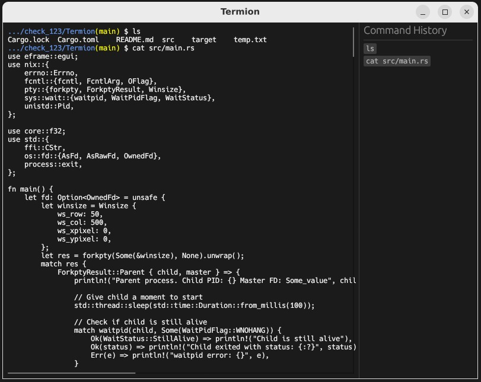

# Termion

A lightweight terminal emulator built in Rust using egui for the graphical interface.

## Features

- **Interactive Shell**: Spawns a bash shell using pseudoterminal (PTY)
- **ANSI Color Support**: Renders colored output with support for bold and standard terminal colors
- **Smart PS1 Prompt**: Displays current directory (trimmed), git branch, and virtual environment
- **Command History Panel**: Side panel with click-to-rerun functionality for previously executed commands
- **Auto-Scrolling**: Automatically scrolls to keep the cursor visible
- **Visual Cursor**: Green block cursor tracking current input position
- **Keyboard Support**: Full text input, Enter, and Backspace handling

## Requirements

- **Platform**: Linux/Unix or Windows with WSL
- **Rust**: Edition 2021 or later
- **Shell**: `/bin/bash`

## Dependencies

| Crate   | Version | Purpose                                  |
|---------|---------|------------------------------------------|
| eframe  | 0.30.0  | GUI framework (egui)                     |
| nix     | 0.29.0  | Unix system calls (PTY, process control) |

## Building

```bash
cargo build --release
```

For development with faster compilation:

```bash
cargo build
```

## Running

```bash
cargo run --release
```

Or run the binary directly:

```bash
./target/release/terminal_emulator
```

## Architecture

The application uses a fork-based architecture with PTY communication:

```
┌─────────────────────────────────────────────────────────┐
│                    Parent Process                        │
│  ┌─────────────┐    ┌─────────────┐    ┌─────────────┐  │
│  │   egui GUI  │◄──►│  PTY Master │◄──►│   Termion   │  │
│  └─────────────┘    └─────────────┘    └─────────────┘  │
└─────────────────────────────────────────────────────────┘
                            │
                     PTY Communication
                            │
┌─────────────────────────────────────────────────────────┐
│                    Child Process                         │
│                    ┌─────────────┐                       │
│                    │  /bin/bash  │                       │
│                    └─────────────┘                       │
└─────────────────────────────────────────────────────────┘
```

### Key Components

- **PTY (Pseudoterminal)**: Creates a virtual terminal pair for bidirectional shell communication
- **Non-blocking I/O**: Prevents GUI freezing while waiting for shell output
- **ANSI Parser**: Interprets escape codes for colored text rendering
- **egui Panels**: Central panel for terminal output, side panel for command history

## Usage

1. Launch the application
2. Type commands directly into the terminal
3. Press **Enter** to execute commands
4. Press **Backspace** to delete characters
5. Click any command in the history panel to re-execute it
6. Scroll horizontally/vertically for long outputs

## Configuration

The shell is configured with:

- `TERM=xterm-256color` for color support
- `PROMPT_DIRTRIM=2` to show only the last 2 directories
- Custom PS1 showing directory (blue), git branch (yellow), and virtualenv (green)

## Known Limitations

- Linux/Unix and WSL only (native Windows not supported)
- Basic ANSI escape code support (colors and SGR codes)
- No tab completion passthrough
- No terminal resize handling
- Command history is not persisted between sessions

## Future Improvements

- [ ] Persist command history to disk
- [ ] Add delete button for history entries
- [ ] Terminal resize support (SIGWINCH)
- [ ] Extended ANSI escape code support
- [ ] Configurable color themes
- [ ] Multiple shell support

## License

This project is open source.
